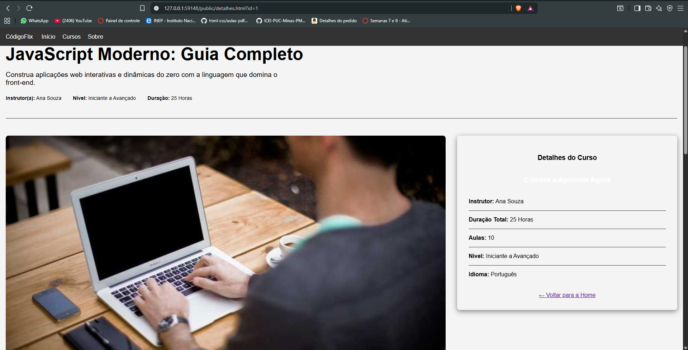

# Trabalho Prático 05 - Semanas 7 e 8

**Páginas de detalhes dinâmicas**

Nessa etapa, vamos evoluir o trabalho anterior, acrescentando a página de detalhes, conforme o  projeto escolhido. Imagine que a página principal (home-page) mostre um visão dos vários itens que existem no seu site. Ao clicar em um item, você é direcionado pra a página de detalhes. A página de detalhe vai mostrar todas as informações sobre o item do seu projeto. seja esse item uma notícia, filme, receita, lugar turístico ou evento.

Leia o enunciado completo no Canvas. 

**IMPORTANTE:** Assim como informado anteriormente, capriche na etapa pois você vai precisar dessa parte para as próximas semanas. 

**IMPORTANTE:** Você deve trabalhar e alterar apenas arquivos dentro da pasta **`public`,** mantendo os arquivos **`index.html`**, **`styles.css`** e **`app.js`** com estes nomes, conforme enunciado. Deixe todos os demais arquivos e pastas desse repositório inalterados. **PRESTE MUITA ATENÇÃO NISSO.**

## Informações Gerais

- Nome: Moisés Carvalho alves Teixeira
- Matricula: 1616955
- Proposta de projeto escolhida: Plataforma de Curso de Programação (CodigoFlix)
- Breve descrição sobre seu projeto: Um site que busca ajudar pessoas que querem estudar programação

## Print da Home-Page


## Print da página de detalhes do item



## Cole aqui abaixo a estrutura JSON utilizada no app.js

```javascript
const cursos = [
    {
        "id": 1,
        "titulo": "JavaScript Moderno: Guia Completo",
        "descricao_curta": "Construa aplicações web interativas e dinâmicas do zero com a linguagem que domina o front-end.",
        "imagem": "https://picsum.photos/id/1/800/450",
        "instrutor": "Ana Souza",
        "nivel": "Iniciante a Avançado",
        "duracao": "25 Horas",
        "sobre": "Este curso é um mergulho profundo no universo do JavaScript. Partindo dos conceitos fundamentais como variáveis, tipos de dados e estruturas de controle, avançamos para tópicos avançados como Programação Assíncrona (Promises, Async/Await), manipulação do DOM, APIs e ES6+.",
        "aprendizados": [
            "Dominar os fundamentos e conceitos avançados do JavaScript.",
            "Manipular o DOM para criar páginas web dinâmicas.",
            "Trabalhar com requisições HTTP e APIs externas.",
            "Entender os paradigmas de programação síncrona e assíncrona."
        ],
        "aulas": [
            "Introdução e Configuração do Ambiente",
            "Fundamentos: Variáveis, Tipos e Operadores",
            "Estruturas de Controle: Condicionais e Laços",
            "Funções e Escopo de Variáveis",
            "Objetos e Arrays",
            "// ... (demais aulas do curso)"
        ]
    }
    
];